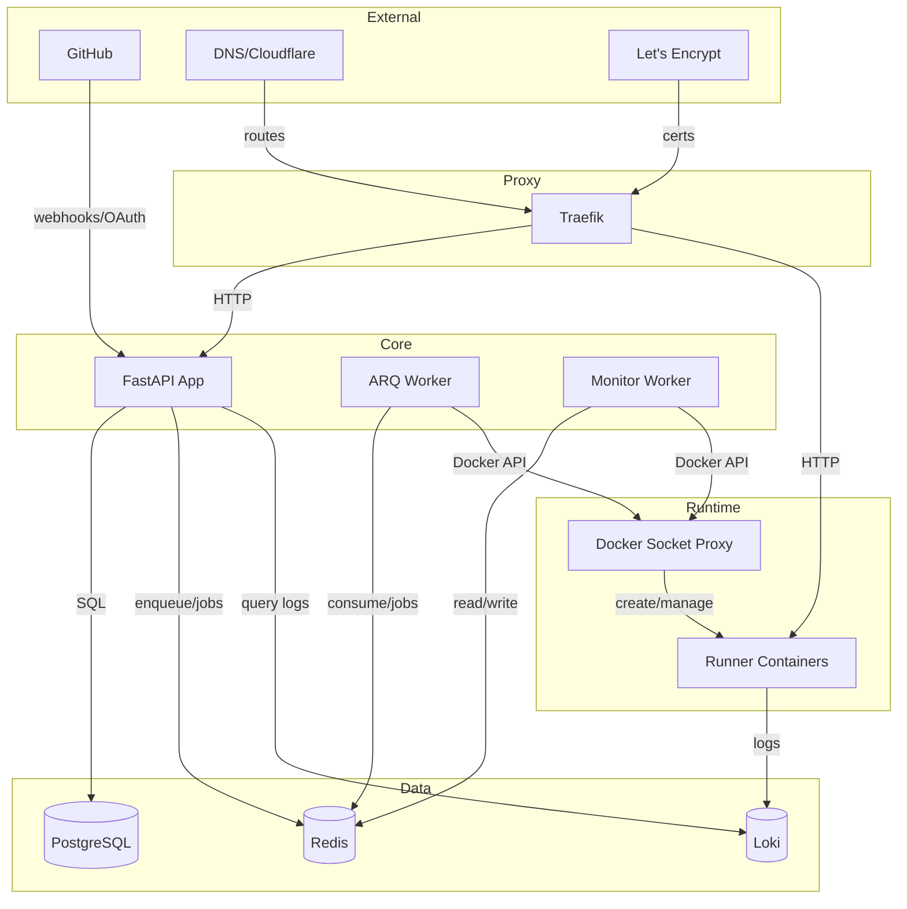
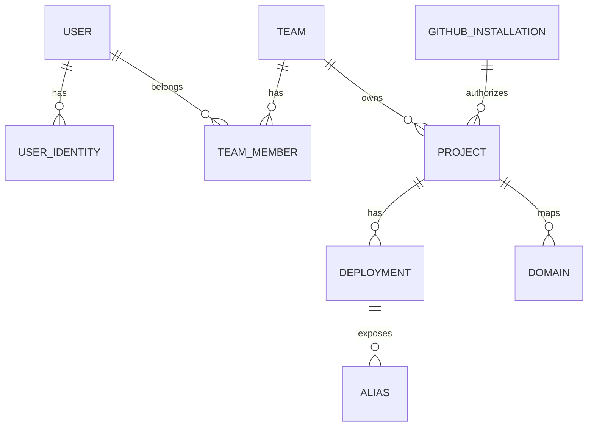

# Architecture

This document describes the high‑level architecture of /dev/push, how the main services interact, and the end‑to‑end deployment flow. It reflects the current implementation in this repo.

## Stack

- Docker & [Docker Compose](https://github.com/docker/compose)
- [Traefik](https://github.com/traefik/traefik)
- [Loki](https://github.com/grafana/loki)
- [PostgreSQL](https://www.postgresql.org/)
- [FastAPI](https://fastapi.tiangolo.com/)
- [arq](https://arq-docs.helpmanual.io/)
- [HTMX](https://htmx.org)
- [Alpine.js](https://alpinejs.dev/)
- [Basecoat](https://basecoatui.com)

## Overview

- **App**: The app handles all of the user-facing logic (managing teams/projects, authenticating, searching logs...). It communicates with the workers via Redis.
- **Workers**: When we create a new deployment, we queue a deploy job using arq (`app/workers/arq.py`). It will start a container, then delegate monitoring to a separate background worker (`app/workers/monitor.py`), before wrapping things back with yet another job. These workers are also used to run certain batch jobs (e.g. deleting a team, cleaning up inactive deployments and their containers).
- **Logs**: build and runtime logs are streamed from Loki and served to the user via an SSE endpoint in the app.
- **Runners**: User apps are deployed on one of the runner containers (e.g. `Docker/runner/Dockerfile.python-3.12`). They are created in the deploy job (`app/workers/tasks/deploy.py`) and then run a series of commands based on the user configuration.
- **Reverse proxy**: We have Traefik sitting in front of both app and the deployed runner containers. All routing is done using Traefik labels, and we also maintain environment and branch aliases (e.g. `my-project-env-staging.devpush.app`) using Traefik config files.

## File structure

- `app/`: The main FastAPI application (see README file).
- `app/workers`: The workers (`arq` and `monitor`)
- `Docker/`: Container definitions and entrypoint scripts. Includes local development specific files (e.g. `Dockerfile.app.dev`, `entrypoint.worker-arq.dev.sh`).
- `scripts/`: Helper scripts for local (macOS) and production environments
- `docker-compose.yml`: Container orchestration with [Docker Compose](https://docs.docker.com/compose/) with overrides for local development (`docker-compose.override.dev.yml`).

## System Diagram

Notes:

- Runner containers push logs to Loki via the Docker Loki log driver. The app queries Loki to stream build/runtime logs to clients (SSE).
- Traefik routes both the app and user deployments. Dynamic file configuration is generated for aliases and custom domains.

## Components

### App (FastAPI)

- Web app and webhook API, allowing users to login and manage teams/projects/deployments.
- Processes GitHub webhooks; creates deployments; serves SSE for project updates and deployment logs.
- Files: `app/main.py`, `app/routers/*`, `app/services/*`, `app/models.py`.

### Workers

#### ARQ

- Background jobs for deployments and cleanup.
- Jobs: `deploy_start`, `deploy_finalize`, `deploy_fail`, `cleanup_*`.
- Files: `app/workers/arq.py`, `app/workers/tasks/deploy.py`, `app/workers/tasks/cleanup.py`.

#### Monitor

- Polls running deployments every ~2s, probes port 8000 over `devpush_runner` network.
- On success enqueues `deploy_finalize`; on failure enqueues `deploy_fail`.
- File: `app/workers/monitor.py`.

### Traefik

- Reverse proxy with Docker and file providers; optional TLS via ACME.
- Routes: app (`APP_HOSTNAME`) and deployments (by Docker labels and dynamic file for aliases/domains).

### Docker Socket Proxy

- `tecnativa/docker-socket-proxy` exposing a limited Docker API used by workers and Traefik.

### PostgreSQL

- Primary datastore (users, teams, projects, deployments, aliases, domains, GitHub installations).

### Redis

- ARQ job queue and Redis Streams for real‑time updates to the UI.

### Loki

- Centralized logs for deployments (build/runtime). Queried by the app for streaming.

## Deployment Flow

1) Trigger
  - Webhook: GitHub -> `/api/github/webhook` (verify, resolve project) -> create DB record -> enqueue `deploy_start`.
  - Manual: user selects commit/env -> create DB record -> enqueue `deploy_start`.

2) `deploy_start`
  - Create runner container (language image, env vars, resource limits, Loki log driver, Traefik labels).
  - Inside container: clone repo at commit, run optional build/pre‑deploy commands, then start app.
  - Mark deployment `in_progress`, set `container_id=…`, emit Redis Stream update.

3) Monitor
  - Probe container IP on `devpush_runner:8000/`.
  - On ready -> enqueue `deploy_finalize`. On exit/error -> enqueue `deploy_fail`.

4) Finalize:
  a) deploy_finalize (success)
    - Mark `status=completed`, `conclusion=succeeded`.
    - Create/update aliases: branch, environment, environment_id.
    - Regenerate Traefik dynamic config for aliases and custom domains.
    - Enqueue `cleanup_inactive_deployments` and emit Redis Stream updates.

  b) deploy_fail (error)
    - Stop/remove container if present; mark `conclusion=failed` and emit updates.

## Data Model (Simplified)

Notes:

- Project env vars and OAuth tokens are encrypted at rest (Fernet).
- Deployment captures a snapshot of project config/env at creation time.
- Aliases track current and previous deployment to support instant rollback.

## Networking

- `devpush_default`: public (Traefik, app, Loki).
- `devpush_internal`: internal (DB, Redis, Docker proxy, Traefik file provider).
- `devpush_runner`: runner network for deployed containers; Traefik and workers attach to route/probe.

## Observability

- Logs: runner containers -> Loki; app queries `Loki /loki/api/v1/query_range` and streams via SSE.
- Status: Redis Streams power SSE for project and deployment updates.
- Health: app `/health`; ARQ `--check`; Docker Compose healthchecks for services.

## Security

- Sessions: signed cookies with CSRF protection (no Redis session storage).
- Secrets: Fernet encryption for env vars and tokens.
- Docker: access via socket proxy with limited capabilities; runner containers run as non‑root with resource limits.

## Scaling

- App and workers can scale horizontally behind Traefik.
- DB and Redis can be sized independently; cleanup tasks keep unused containers down.

## Implementation Notes

- Traefik dynamic config for aliases/domains is written to `TRAEFIK_CONFIG_DIR` per project (`DeploymentService.update_traefik_config`).
- Runner images are language‑specific (e.g., Python, Node). Selection and commands come from project config.
- SSE endpoints: `app/routers/event.py` for project updates and deployment logs.
